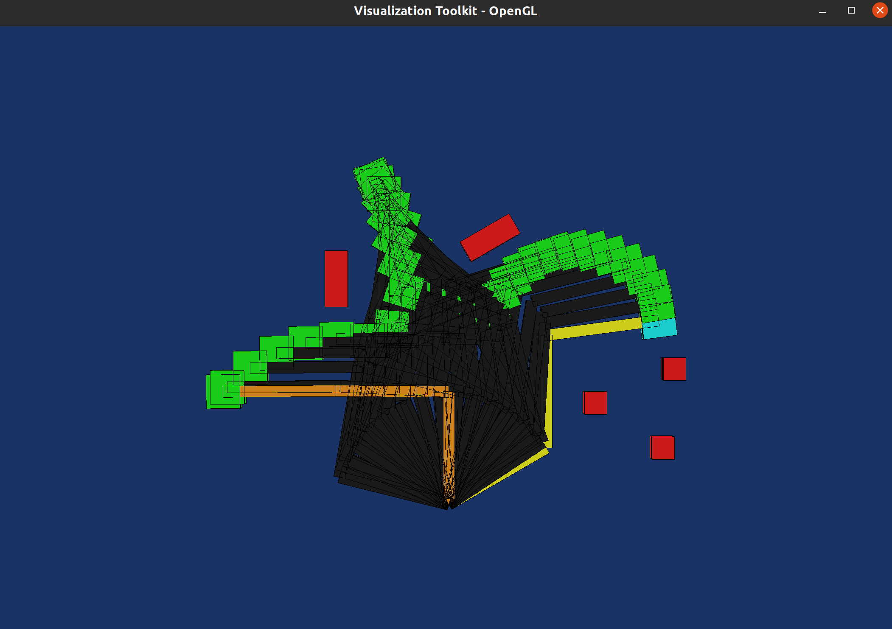

# Planar Robot Box Moving
This project implements a solution to a toy planning problem where a 3 dof planar robot arm has to move from one pose to another while carrying a box.

## Notable Implemented Features
* Forward and Inverse Kinematics for the 3-dof planar arm.
* 2D environment with Boxes.
* Collision checking of arm and environment accounting for the attached box to the end effector.
* Planning from picking a box from a start pose and placing it to a goal pose while maintaining specified clearance.
* A light weight visualization of path and the environnment uding VTK OpenGL visualisation.


## Installation Instructions

1. Install Docker on your system if already not installed. Follow the installation steps listed here [Docker Installation](https://docs.docker.com/get-docker/)
2. Run the following commands from your terminal
    ```sh
    git clone https://github.com/raghavsood1996/Planar-Arm-Box-Moving-Planner.git
    cd Planar-Arm-Box-Moving-Planner/
    ```
3. Build the docker image by running 
    ```sh
    docker build -t planar_robot_box_moving .
4. Allow docker to forward its xserver display to show visualizations by running the following command.
    ```sh
    xhost +local:docker
    ```

## Running Test Cases
The test directory in the repo has two files
* **environment.yaml**: Defines the environment comprising of various boxes. Here is example of what this file looks like
```yaml
boxes:
  - uid: "box_1"
    x: 2.0
    y: 1.2
    alpha: 0
    w: 0.2
    h: 0.2
  - uid: "box_2"
    x: 1.3
    y: 0.9
    alpha: 0
    w: 0.2
    h: 0.2
```
where `uid` id unique id for a box, `x` is the x coordinate, `y` is the y coordinate, `alpha` is th orientation angle from the x-axis, `w` is the width and `h` is the height.

* **test_cases.yaml**: Defines some example test cases for the given environment file. Here is an example of what this file looks like
```yaml
test_cases:
  - start_pose: [2.0, 1.2, 0.0]
    goal_pose: [-2, 1.0, 3.14898]
    target_box_uid: "box_1"
    clearance_threshold: 0.05
```
Here `start_pose` is the `{x,y,theta}` end effector pose for picking up the box, `goal_pose` is the end effector pose for placing the box. the `target_box_uid` is the id of the box we are picking and the `clearance_threshold` is the minimum clearance to respect while planning the path.

You can run the test cases specidfied in these files by just running the following command
```sh
docker run -e DISPLAY=$DISPLAY --net=host planar_robot_box_moving
```
## Interpreting Results
After you run the above command you will see an image like this pop up

* Here The **Yellow** state represents start state picking a **light blue** target box.
* Other **Red** cuboids are the obstacles/other boxes in the environment.
* The **Dark Grey** states with green box attached to the end effector show the path.
* The **Orange** state shows the goal stae reached.

To proceed to the next test case just close the pop-up window.
